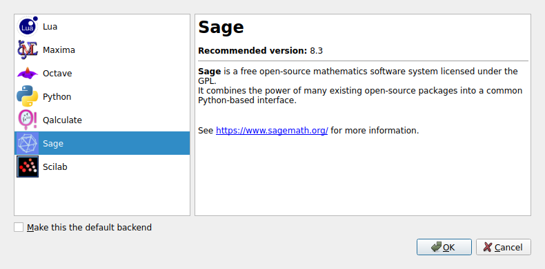
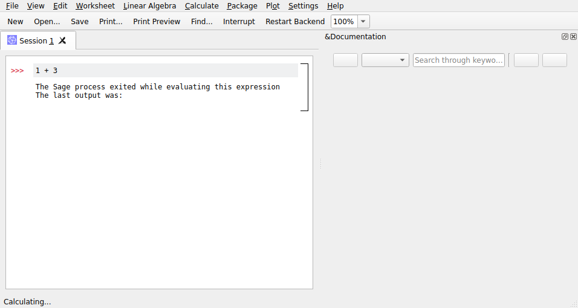

# Cantor on NixOS

Cantor is a KDE frontend for computational notebooks.

`u/Orlando--` [posted in the NixOS subreddit](https://www.reddit.com/r/NixOS/comments/tl4hm7/cantor_on_nixos/) asking for help hooking up backends to the cantor frontend, which they managed to compile successfully.

This is my attempt to pitch in - I've mainly added `shell.nix` that pulls in the frontend together with several backends.
Unfortunately, it's not working for me with Sage for some reason, but the others seem fine.

## Instructions

To run cantor together with several backends, just run

```
nix-shell --run cantor
```

### Cantor-only

To build cantor without the backends, run

```
nix-build build.nix
```

and then run via

```
./result/bin/cantor
```


## Error with Sage Backend

The Sage appears to be detected when run from the `nix-shell`



But when I actually try to execute a cell, I just see an undescriptive error message

```
The sage process exited while evaluating this expression
The last output was:
```




## References

Inspired by:
- https://www.reddit.com/r/NixOS/comments/tl4hm7/cantor_on_nixos/
- https://nix-tutorial.gitlabpages.inria.fr/nix-tutorial/notebook.html
